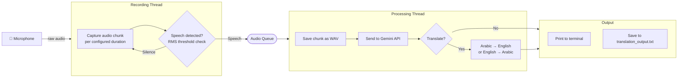

# Speech Translator

A real-time speech to text translation tool using Google's Gemini API.

## Project Structure

```
.
|-- README.md
|-- requirements.txt
|-- speech_to_text.py
`-- src/
	`-- gemini_realtime_stt/
		|-- __init__.py
		|-- app.py
		|-- audio.py
		|-- config.py
		|-- console.py
		|-- gemini_client.py
		`-- pipeline.py
```

- `speech_to_text.py`: Compatibility entrypoint for running the app directly.
- `src/gemini_realtime_stt/app.py`: Main orchestration (threads, startup, shutdown).
- `src/gemini_realtime_stt/audio.py`: Microphone capture and silence filtering.
- `src/gemini_realtime_stt/gemini_client.py`: Gemini transcription/translation calls.
- `src/gemini_realtime_stt/pipeline.py`: WAV chunk persistence and processing pipeline.
- `src/gemini_realtime_stt/config.py`: Centralized runtime configuration.

## Architecture

The project employs a multithreaded architecture to ensure contiguous audio recording without dropping frames while API requests are pending.



## Features
- Continuous audio recording and processing
- Real-time transcription of speech
- Translation between languages (configurable)
- Saves transcriptions to a file

## Requirements
- Python 3.x
- PyAudio
- NumPy
- Google Generative AI Python SDK 


## Installation

1. Clone the repository:
git clone https://github.com/folubebe/gemini_realtime_speech_to_text.git
cd gemini_realtime_speech_to_text

2. Install dependencies:
pip install -r requirements.txt

3. Create an API key from https://aistudio.google.com/apikey

Set the API key as an environment variable:
set GOOGLE_API_KEY=your-api-key-here

Or use a `.env` file in the project root (auto-loaded at startup):
1. Copy `.env.example` to `.env`
2. Update the values, especially `GOOGLE_API_KEY`

Example `.env`:
GOOGLE_API_KEY=your-api-key-here
CHUNK_DURATION_SEC=5
TARGET_LANGUAGE=English
SOURCE_LANGUAGE=auto
OUTPUT_FILE=translation_output.txt
MODEL_NAME=gemini-2.0-flash

## Usage

Run the script:
python speech_to_text.py

Follow the prompts to select your input device. The script records audio in 5-second chunks, processes them, and prints transcription/translation output in real-time.

You can configure these values from `.env` (or defaults in `src/gemini_realtime_stt/config.py`):
- `chunk_duration_sec = 5`: Duration in seconds for each audio chunk
- `target_language = "English"`: Desired output language
- `source_language = "auto"`: Source language (or auto-detect)
- `output_file = "translation_output.txt"`: Output transcript file
- `model_name = "gemini-2.0-flash"`: Gemini model used for transcription

Press Ctrl+C to stop the recording. Transcriptions will be saved to `translation_output.txt`.
